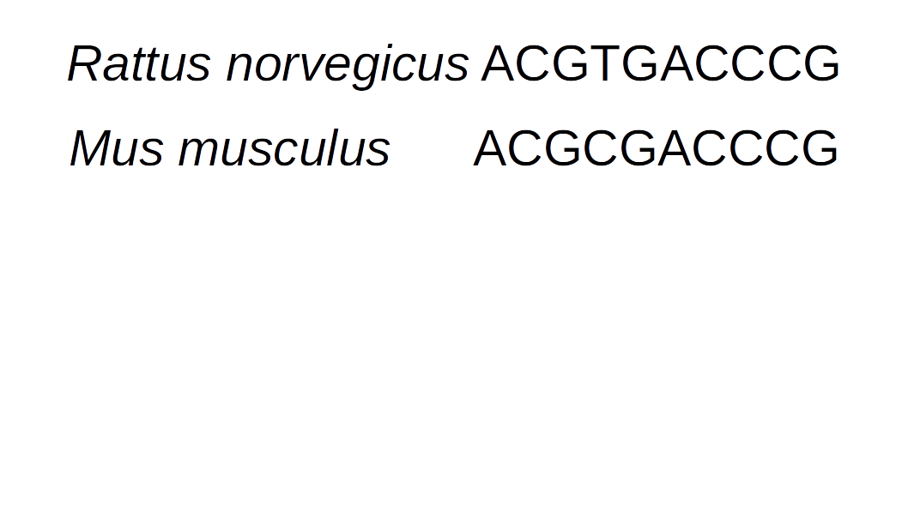
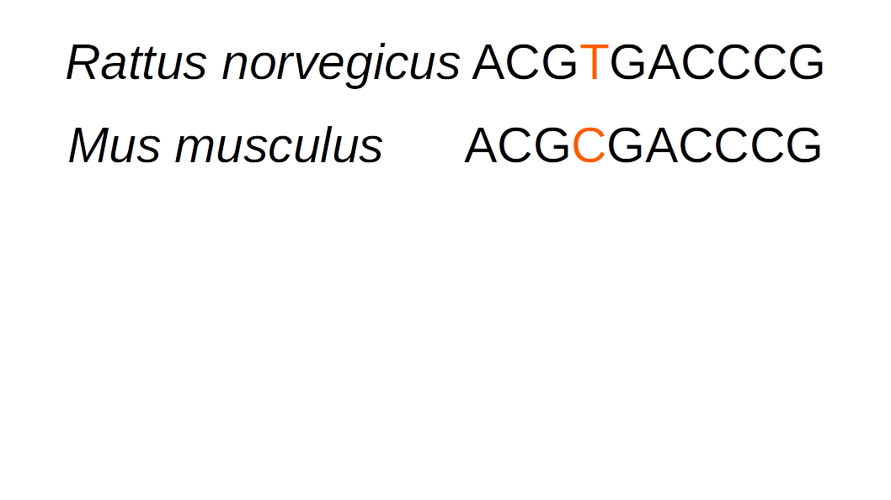
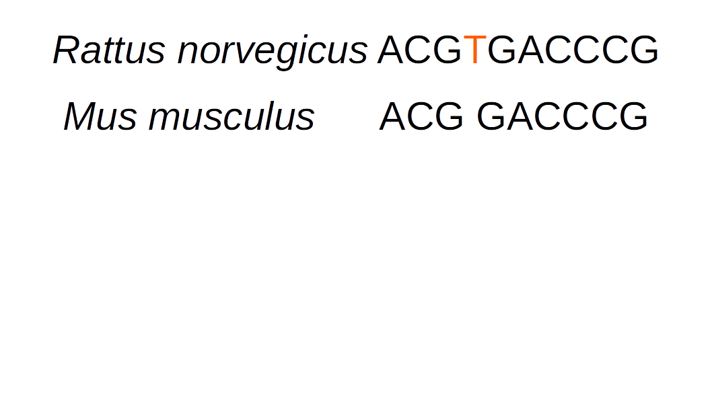

Core to the idea of phylogenetics and systematics is the idea of homology. You'll read a bunch about homology in class. **Homology** refers to two structures in different taxa having a common evolutionary origin. The classical example is the wings of a bat, our arms, and the forearms of a cat or dog. We know that these characteristics are homologous based on several criteria:

 - Bones being in the same place
 - Bones being shaped and joined similarly
 - Developmental studies showing the same cells forming each of these structures
 - Fossils from different stages in evolution
 
 Historically, each of these things has been seen as evidence that a structure is homologous. Depending on what raw material you have available, you might have all of the above pieces of evidence, or only one or two. Paleontologists, for example, rarely have developmental information. 
 
Traits that are considered to be homologous are often broken up into character states. A state is a form of a character. States can be discrete,or they can be continuous.

Knowing whether or not a character in one organism is homologous to a character in another forms the basis of phylogenetics. If a character isn't homologous, we can't model it's evolution over time, whether we're doing parsimony modeling or likelihood or Bayesian. 

 
## Activity break

In front of you are skulls. Each group of two gets two skulls. In small groups, look at the skulls and pick one feature on the skull. Decide what character stat each skull has for that character, and note this down, along with the diagnoses of each character.

## Molecular Homology Assessment

Morphological homology assignment isn't easy. People often work for years to develop the skills to do it. Continuous characters, such as geometric morphometric landmarks, often have more technical tricks to collect. Technologies to collect these automatically are also being developed. 

In the same way that morphological homology forms the basis of morphological phylogenetics, molecular homology forms the basis of molecular phylogenetics. Instead of the homology of physical structures, however, we are often assessing the homology of sites in the genome. In the 80s, 90s and 2000s, this often meant figuring out which sites in a known gene are homologous. For example, is site 132 in COII in *Canis lupus* homologous to site 132 in *Nerodia rhombifer*? Or have insertions and deletions meant that site 132 in dogs is homologous with site 363 in water snakes? Increasingly, we no longer even have the name of the gene to help us - we may be using data sources such as ddRADseq or targeted capture to try to find homology. These data are far too large for a human to manually or by-eye assess homology.

So what are the algorithms for homology detection in molecular data? You've probably heard the term *alignment* before. This is where we'll begin.

The basic concept to alignment is that we use a scoring matrix to asses how likely or unlikely different types of changes are within a nucleotide sequence. In closely-related taxa, this is often fairly easy.

We can see in this sequence that there is one subsitution between the two seqeunces:

We can also have deletion events.

We typically solve this by inserting a "gap":

But the longer evolutionary time separates two lineages, the more change events there will be:

So how do we figure it out? How do we sort out which columns in the alignment are homologous with which? The goal of multiple sequence alignment (MSA) is to introduce gaps such that each residue in a _column_ will be homologous. At the end of this process, we have a data matrix in which the residues in each column are hypothesized to be descended from a residue in a common ancestor.

This typically takes the form of several possible moves:  
1. Rewarding matches.  
* Add to alignment score  
2. Penalize opening gaps.  
* Decrement score. Typically 5 points to open.   
3. Penalize rare substitutions, but not slight differences.  
* Decrement score.  
4. Penalize extending gaps.  

The alignment that maximizes the total score is considered to be the best. There are multiple ways of achieving an alignment. We will cover three of them today.  

First, let's do a completely naive scoring matrix to score the above sequences. We will assume a gap opening penalty of one, and a gap extension penalty of one, and that every substitution has a score of one. What is the score on the above matrix?

We often use what are called _scoring matrices_ to obtain the score of individual substitutions. We will talk about many types of substitution matrices throughout the semester. One that is commonly used in alignment is BLOSUM 62, which is based on empirically-calculated likelihoods of seeing different types of substitutions. 

Try recalculating the score of the rat-mouse data under this matrix.

Now, we mostly don't do alignments by hand. There are three major categories of multiple sequence aligners. We'll talk briefly about each before doing genome-scale homology assessment next week.

##Progressive MSA

Pairwise Multiple Sequence Alignment does exactly what we discussed above, for all your sequences. Typically, this is performed by first performing a pairwise MSA, as we did above, between the two sequences with the least differences. Then, sequences are added in the order of least differences. Progressive alignments score different alignment possibilities based on the alignment and user-specified scoring matrices, such as BLOSUM 62, or others. Clustal is an example of progressive alignment, but is known to be fairly innaccurate. Another example is T-COFFEE.

##Iterative Approaches to MSA

Progressive aligners make a set of assumptions, and apply those assumptions to the whole set of sequences across a phylogeny. But many datasets are fairly large, and may have different evolutionary dynamics across the tree. *Iterative aligners* use tree information to guide the process of making the alignment.  For example, PASTA, below, uses this approach. This is broadly similar to how we will approach alignment next week.

##Coestimation of MSA and Phylogeny

Phylogenetic esitmation generally assumes that we know the alignment without error. We've already seen in our examples cases where we do not get the same alignment between methods. This is particularly true in areas that are hard to align. For example, in the below paper, they estimate a tree for fungi, which are deeply-diverged, and very diverse. The alignment has many problematic regions. What they showed in this paper was that by not accounting for the alignment uncertainty, support was overestimated for their tree hypothesis.

We haven't talked about Bayesian estimation, so I'm going to say very little on joint estimation of alignment and topology. This is a method that allows for a wide range of models to be deployed in order to estimate both the alignment and the tree, and shows great promise for difficult alignment issues. We have a few floating open labs throughout the semester, so if this is a topic of interest to people, we can revisit it then.

The primary software that performs this analysis is [Bali-Phy](http://www.bali-phy.org/Tutorial3.html), which is described [here](http://www.bali-phy.org/Redelings_and_Suchard_2005.pdf).

## Alignment Homework

### Some of these questions do not have a right answer.

Fill out this worksheet (it can be opened in a plain text editor, like TextEdit [Mac] or TextWrangler [Mac] or Notepad [Windows]. Commit and push it to your copy of the course repo. I will pull your copies Friday at 5, and try to have comments for you by next class period, when we will discuss them. 

Feel free to work in groups, and discuss the assignments as needed. However, I do expect you to turn in your own copy, with answers in your own words.

1. Some algorithms treat a gap as a single penalty value, regardless of how large the gap is. Others assess a gap opening penalty, then a smaller gap extension penalty. When (i.e. what kind of biological scenarios) might you think it might be better to use one algorithm over the other?

2. Breaking problems into subproblems is a common way to attack a tough problem. In the case of iterative alignments, we break the tree into smaller pieces. Are there biological questions for which you expect this would not be helpful? 

3. Briefly describe what you're hoping to get out of this class. If you have empirical data, please explain what the data are, and what you'd like to do with them.

