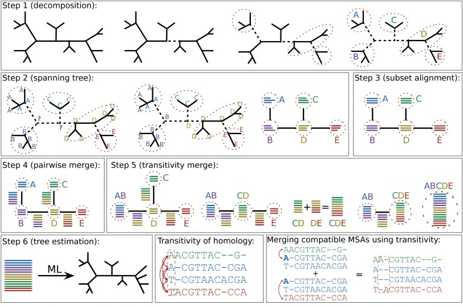

## Progressive MSA

Pairwise Multiple Sequence Alignment does exactly what we discussed last week, for all your sequences. Typically, this is performed by first performing a pairwise MSA, as we did above, between the two sequences with the least differences. Then, sequences are added in the order of least differences. Progressive alignments score different alignment possibilities based on the alignment and user-specified scoring matrices, such as BLOSUM 62, or others. Clustal is an example of progressive alignment, but is known to be fairly innaccurate. Below, we use T-COFFEE to get an alignment. 

First, we will download [T_COFFEE](https://tcoffee.org/Projects/tcoffee/#DOWNLOAD).

We haven't played with any software yet in this class, so I'll now have you create a single location for all your software to live. Change directories into your home. Copy t-coffee into your user home.

```
cp t_coffee
~/
```


Now, back out into your work directory:

```
cd ../../
```

And clone our class resources to get our data:


```
git clone https://github.com/wrightaprilm/Systematics2020.git
```

We'll now run t_coffee on its default settings (a BLOSUM62 matrix with no gap penalty). First:


```
~/t_coffee data/sh3.fasta
```
Now, we'll try a gap-opening penalty:

```
~/t_coffee data/sh3.fasta -matrix blosum62mt -gapopen 5 -outfile=gapopen5
```

And one with a gap-extending penalty: 
```
~/t_coffee data/sh3.fasta -matrix blosum62mt -gapopen 5 -gapext 5 outfile=gapopen5
```

Try one or two more additional alignments, such as increasing the gap open or extension. 

Now, transfer your .aln files to your home directory, then to your personal machine using the scp command. 

```
scp <you username>@loni.org:/work/<your username>/Systematics2020/<output file> .

```


Use [T-Coffee's online viewer](http://tcoffee.crg.cat/apps/tcoffee/do:core) to view them.

As you're doing this, chat with a partner. What is different between the resulting alignments? Do you have a sense for which you think is "best"?


## Iterative Approaches to MSA

Progressive aligners make a set of assumptions, and apply those assumptions to the whole set of sequences across a phylogeny. But many datasets are fairly large, and may have different evolutionary dynamics across the tree. *Iterative aligners* use tree information to guide the process of making the alignment. 



Now, we will download PASTA:

```unix
git clone https://github.com/smirarab/sate-tools-linux.git
git clone https://github.com/smirarab/pasta.git
```

And we will load a couple libraries required by pasta:
```unix
module load java
module load python/3.5.2-anaconda-tensorflow
```

Now, we build pasta:

```unix
python setup.py develop --user
```

Before you leave the directory, give yourself permission to execute this file. 

We will be submitting these jobs to the nodes of the LONI computer. Change directories back into your home directory.

Now, change directories into your work directory. Create a directory called "lab1", containing three subdirectories: "data", "scripts", and "output".

Enter the SELUSys2018 class directory. In it, there is a directory called scripts. List this directory. If you have a script called "pasta_script1", copy this script into your lab1 scripts directory. If you do not have this file, type

```
git pull
``` 

to update this directory. Move the script into your lab1 scripts directory.

Use a text editor to open pasta_script1. Let's unpack this script together. Feel free to make notes in your script about what different parts mean.

Now, we will run the script. 
```
qsub pasta_script1
```

As this runs, we will discuss the output that is appearing to the screen. 

Now, we will look at the output. Create an "exercise_one" directory in the output directory. Move all of the outputs into the exercise_one directory. 

Copy the pastajob.marker001.pythonidae.aln and pastajob_temp_iteration_2_tree.tre into your user home:

```
cp output/exercise_one/pastajob_temp_iteration_2_tree.tre ~/
cp output/exercise_one/pastajob.marker001.pythonidae.aln ~/
```

Now, we will copy these files to our local machine. Open a new terminal window. Navigate to the class repository, and make a lab1 directory, with somewhere to store the output. Change directories into it. Now, we will use secure copy to move the alignment file into our directory:

```
scp <username>@qb2.loni.org:~/pastajob.marker001.pythonidae.aln .
scp <username>@qb2.loni.org:~/pastajob_temp_iteration_2_tree.tre .
```
 

### Choice of Tree Estimator

Pasta allows us to build a tree for iterative estimation in different ways. [FastTree](http://www.microbesonline.org/fasttree/) has some known [accuracy issues](http://journals.plos.org/plosone/article?id=10.1371/journal.pone.0027731). That's probably not an issue for an early stage analysis that will be improved. But let's have a look at what happens if we use a better alignment. 

In the class repository, there is a second script for today, pasta_script2. Copy it into your lab1 folder. Open it in nano. We will need to edit the working directory, and your email address. 

From the lab1 directory, submit the script to the nodes using:

```
qsub pasta_script2
```

You can check on the progress of your job by typing 

```
qstat -u <your username>
```

You'll get output something like this:

```
Req'd   Elap
Job ID               Username    Queue    Jobname          SessID NDS   TSK    Memory Time  S Time
-------------------- ----------- -------- ---------------- ------ ----- ------ ------ ----- - -----
446904.qb3           amwright    workq    binarysims        65908     1     20    --  36:00 R 29:17
447323.qb3           amwright    workq    MSsims           101460     1     20    --  36:00 R 06:59
447478.qb3           amwright    single   pasta             99242     1      1    --  01:00 R 00:01
```

Unfortunately, the way this cluster is configured, you won't see any output from the actual analysis until it finishes running. This analysis will take about ___ minutes.

While it runs, we will set up a new analysis.

### Changing Number of Subsets

Open a tree from one of the iterations in IcyTree. How many clades do you think are on this tree? What size are they? Make a copy of the pasta_script2 to pasta_script3. Add the option "--max-subproblem-size=", and choose what you think is the maximum clade size on this tree. Edit the jobname to something unique.

### Comparing alignments

As your alignments finish, copy them to your computer - the final alignments will be in the .aln file. We will view our alignment files in [Wasabi](http://wasabiapp.org/), which is a simple-browswer based alignment. 

It can be very hard to appreciate the differences between alignments by eye. We will try making comparisons with [FastSP](https://github.com/smirarab/FastSP), which gives [some at-a-glance comparisons](https://academic.oup.com/bioinformatics/article/27/23/3250/234345).

Change directories back to your home directory. Clone the FastSP software:

```
cd ~/
git clone https://github.com/smirarab/FastSP.git
```
Now, change back to your previous directory with:

```
cd -
```

You can call FastSP like so:

```
java -jar ~/FastSP/FastSP.jar -r reference_alignment_file -e estimated_alignment_file
```

So, for example, if I wanted to compare the alignment I estimated  with Pasta, using FastTree,  and the one with Pasta and Raxml, my command would look like

```
java -jar ~/FastSP/FastSP.jar -r /output/exercise_one/pastajob.marker001.pythonidae.aln -e /output/exercise_two/pastajob.marker001.pythonidae.aln
```

FastSP calculates a few summary statistics on alignments. It's output should look like:

```
Reference alignment: /Users/april/Documents/SELUSys2018/lab1/output/pasta_exercise2/smallrax2.marker001.small.aln ...
Estimated alignment: /Users/april/Documents/SELUSys2018/lab1/output/pasta_exercise3/subset_exp.marker001.small.aln ...
MaxLenNoGap= 1027, NumSeq= 32, LenRef= 1169, LenEst= 1180, Cells= 75168
computing ...
Number of shared homologies: 447050
Number of homologies in the reference alignment: 486886
Number of homologies in the estimated alignment: 487792
Number of correctly aligned columns: 716
Number of aligned columns in ref. alignment: 1069
SP-Score 0.9181820795833111
Modeler 0.9164766949847476
SPFN 0.0818179204166889
SPFP 0.0835233050152524
Compression 1.009409751924722
TC 0.6697848456501403
```

The first line is some information that shouldn't surprise us too much: the maximum length of sequence in the file without gaps, NumSeq is the number of sequences in the file, the two Lens are the lengths of the alignments (including gaps), and cells are the total number of cells (num seq x number of nucleotides per line, summed for both alignments).

Number of shared homologies refers to how many filled cells are filled in both, or gaps in both. Number of homologies in the reference/estimated alignment is the number of pairs of letters from the input sequences that occur in the same site - this can be larger than the amount of cells, because you'll make multiple comparisons per column. 
 

Based on these metrics, which alignment do you prefer? What other information would you want to know before choosing an alignment for your project?


##C oestimation of MSA and Phylogeny

Phylogenetic esitmation generally assumes that we know the alignment without error. We've already seen in our examples cases where we do not get the same alignment between methods. This is particularly true in areas that are hard to align. For example, in the below paper, they estimate a tree for fungi, which are deeply-diverged, and very diverse. The alignment has many problematic regions. What they showed in this paper was that by not accounting for the alignment uncertainty, support was overestimated for their tree hypothesis.


We haven't talked about Bayesian estimation, so I'm going to say very little on joint estimation of alignment and topology. This is a method that allows for a wide range of models to be deployed in order to estimate both the alignment and the tree, and shows great promise for difficult alignment issues. We have a few floating open labs throughout the semester, so if this is a topic of interest to people, we can revisit it then.

The primary software that performs this analysis is [Bali-Phy](http://www.bali-phy.org/Tutorial3.html), which is described [here](http://www.bali-phy.org/Redelings_and_Suchard_2005.pdf).


# Homology in massive datasets

Homology is difficult to assess in massive datasets, particularly those from genomic data. For example, ddRAD sequencing is common in the life sciences. It is common because it's fairly cost effective and obtains a sample of loci from across the genome. If you're working with this data, I really do recommend having a look at [this](https://journals.plos.org/plosone/article?id=10.1371/journal.pone.0037135) paper describing the method. The salient figure is below:


We'll be using the iPyRad software from Deren Eaton's lab. You can see the [paper](https://academic.oup.com/bioinformatics/advance-article-abstract/doi/10.1093/bioinformatics/btz966/5697088?redirectedFrom=fulltext) for the software, or look at the [source code.](https://github.com/dereneaton/ipyrad/) On the board, let's draw the workflow of iPyRad. This tutorial heavily borrows from one of Deren's.

```
# The curl command is used to download the installer from the web. Take note
# that the -O flag is a capital o not a zero.
wget https://repo.continuum.io/miniconda/Miniconda3-latest-Linux-x86_64.sh

# Install miniconda into $HOME/miniconda3
bash Miniconda3-latest-Linux-x86_64.sh -b

# Initialize and activate your conda install
conda init bash
bash

# test that conda is installed. Will print info about your conda install.
conda info

conda install ipyrad -c bioconda
conda install notebook -c conda-forge
conda install mpi4py -c conda-forge

```

Now, we'll download some test data. This is plant data collected by the author of iPyRad, Deren Eaton.

```
curl -LkO https://eaton-lab.org/data/ipsimdata.tar.gz
tar -xvzf ipsimdata.tar.gz
```

Have a look at these data. What is in this folder?

Try this:

```
gunzip -c ./ipsimdata/rad_example_R1_.fastq.gz | head -n 12
```

What does this show? Why do we need to zip this sort of data? What do you think these four lines are?

What does the below line do?

```
cat ./ipsimdata/rad_example_barcodes.txt
```

What do these barcodes mean?


Now, we will begin to analyse the data:


```
ipyrad -n iptest
```

Above, we created a new parameter file. This file will hold any input we want to have on our analysis. Let's open this file with `nano` and look at it.

Edit lines two and three to contain the paths to your raw fastq files and your barcodes file.


The first step in assembling a matrix from ddRAD data is to separate the reads by bardcode:

```
ipyrad -p params-iptest.txt -s 1
```

What is the end result of this step? Take a look at this command to figure it out. Where else have you seen the alpha-numeric codes at the start of the file names:

```
ls iptest_fastqs
```

We can view stats on the number of reads we retained with this command:

```
 ipyrad -p params-iptest.txt -r
 
 ```
 
Now, we filter our reads based on quality score.


```

ipyrad -p params-iptest.txt -s 2

```

Filtering can be subjective. Some relevant parameters in here are maximum number of low-quality bases in a read and what Phred Quality score to be the lowest base score (33 is an emerging consensus value).

Next, we find all the copies of the same locus within each sample. Line 14 specifies the clustering threshold - 85%. This means reads with 85%+ similarity will be assumed to represent the same locus. More stringent, and you might assume reads that are the same are actually different loci (i.e., inflate your number of loci). Too loose and you may lose loci. Remember that 85% may sound low, but next-gen sequencing is generally more error-prone than Sanger sequencing.

```
ipyrad -p params-iptest.txt -s 3
```
 Our next step will estimate two things: heterozygosity (which alternate reads are genuinely different alleles) and error (which are due to sequencing error). People generally tend to look at this as such: say you have three different 'alleles' in your stack of reads. Two of them are present in 999 out of 1000 samples. The third one is two base pairs different from allele two, and only observed once. Do you think that's a genuine third allele?
 
```
ipyrad -p params-iptest.txt -s 4
```

We then take this info, and use it to come up with consensus reads for each locus:

```
ipyrad -p params-iptest.txt -s 5
```

The next thing we need to do is try to merge the stacks of loci for each sample with the stacks for other samples:

```
ipyrad -p params-iptest.txt -s 6
```

We're trying to match the loci at one sample to others. After all, we want to be able to have shared loci across samples so we can build a tree.

And finally, we write it all out:

```
ipyrad -p params-iptest.txt -s 7
```

This sounds like t should be an easy step, but it can actually be quite challenging. There are a number of parameters in the params file that apply here - number of SNPs, number of indels, accepted number of alleles at a locus. You may want to examine these values for your data. The final files will be in iptest_outfiles. Have a look at the .phy file. Does it look familiar?

## Alignment Homework

### Some of these questions do not have a right answer.

Feel free to work in groups, and discuss the assignments as needed. However, I do expect you to turn in your own copy, with answers in your own words.

1. Some algorithms treat a gap as a single penalty value, regardless of how large the gap is. Others assess a gap opening penalty, then a smaller gap extension penalty. When (i.e. what kind of biological scenarios) might you think it might be better to use one algorithm over the other?

2. Breaking problems into subproblems is a common way to attack a tough problem. In the case of iterative alignments, we break the tree into smaller pieces. In assembling our ddRAD matrices, we build stacks of loci per sample first. Are there biological questions for which you expect this would not be helpful? 

3. Have a look at the [Stacks](http://catchenlab.life.illinois.edu/stacks/) software. Briefly compare and contrast Stacks and PyRad.


## References:
* T-Coffee Manual: http://tcoffee.readthedocs.io/en/latest/
* Pasta Algorithm Description: https://www.ncbi.nlm.nih.gov/pmc/articles/PMC4424971/
* Sate Algorithm Description: https://academic.oup.com/sysbio/article/61/1/90/1680002
