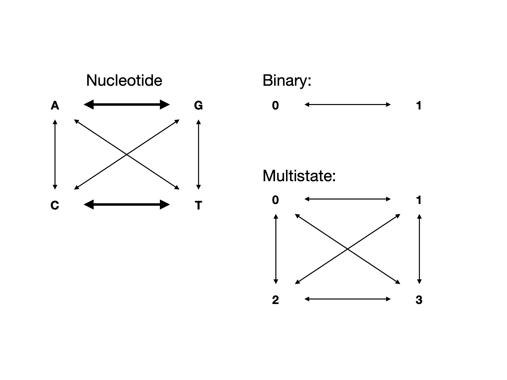

## Maximum Parsimony Analysis Using PAUP

Today, we will use  PAUP* (Phylogenetic Analysis Using Parsimony [*and other methods]) to estimate a phylogeny using the maximum parsimony optimality criterion. We will also practice performing bootstrap and jackknife quantification of uncertainty. In the process, we will also see some of the basics of how phylogenetic software will read data and understand models.


## Download PAUP and Data

I have already installed paup for you. But if you wanted to, you could do it like so.

```UNIX
 curl -O  http://phylosolutions.com/paup-test/paup4a168_centos64.gz
 gunzip paup4a168_ubuntu64.gz 

```

Now, move into your lab_three directory. Make a Data, Results, and Scripts subdirectories inside of it. Enter the Data directory. Copy the data from class repository (`data/PAUPlab`). The following is a fill in the blank - figure out how you get from your data directory to the classroom data dir. 

```UNIX

cp __/data/PAUPlab ./Data
``` 


## PAUP 

Paup is one of the older phylogenetics software packages available, and Dave Swofford has put considerable effort into ensuring that the main mechanisms and models are correct. Many of us who do other software development use PAUP as a check on our own calculations.

PAUP reads in data in the Nexus format. Go ahead and use nano to open the primate dataset. 

Next, we will open PAUP:

```UNIX
/cloud/project/software/paup4a168_ubuntu64
```

You should get something like the below:

```UNIX
P A U P *
Portable version 4.0b10 for Unix
Sat Feb 17 16:04:16 2018

      -----------------------------NOTICE-----------------------------
        This is a beta-test version.  Please report any crashes,
        apparent calculation errors, or other anomalous results.
        There are no restrictions on publication of results obtained
        with this version, but you should check the WWW site
        frequently for bug announcements and/or updated versions.  
        See the README file on the distribution media for details.
      ----------------------------------------------------------------

paup>

```

Next, we will load in the data file, using the execute command. Execute is kind of PAUP's catch-all for loading in data.

```UNIX
execute primate-mtDNA.nex
```

Let's have a look at the screen output. What information does it tell us?

Some other useful commands are:

```
cstatus
tstatus
showmatrix
showdist
log file="mylogfile"
```

Try each command. What is it telling you? If any of them are still unclear, you can add a question mark after the command to get more info.

First, we will compute a parsimony tree using the command all trees:

```UNIX
alltrees;
```

This will take a moment. Let's talk about parsimony, and the alltrees command. What is that command doing? What is parsimony doing? [go to board exercise]

Look at the best tree with the command showtree:

```unix
showtree;
```

Are we surprised by the length of the tree, given the number of characters?

Next, we will try heuristic searching:

```unix
hsearch
```

Note that a heuristic is being applied. What is a heuristic? 

Did it make a difference to the score of the best tree? Why?

Let's try some data that are too large for an exhaustive search:

```
execute BardenClean.nex
```

This is some of my research data. Try to execute alltrees now. What does this message mean? Now try the heuristic search.

What is the score of the best tree you found _________. How many best trees were there? ________ Try one of the alternative swap measures (either NNI or SPR). 

```
hsearch swap= ______
```

What was the score of your best tree? When would you expect the swap algorithm to matter strongly?

Now, save some trees:

```UNIX
savetrees from=1 to=1 file=Results/tree1.tre;
savetrees from=2 to=2 file=Results/tree1.tre;
```

Download them. How are these trees different? Why is PAUP saving multiple trees? 

To confirm our intuition, let's score them all under parsimony:

```
pscore 1-121
```

This will print the number of parsimony steps on each tree. Does this confirm what you thought before? 

We can summarize the trees with a consensus tree:

```
contree all / treefile=Results/contree.tre;
```

If you look at the help for the consensus tree function, you see that there are several options for how to compute the consensus tree. The default is **strict:** the tree which contains only groups found in all trees. **Semistrict** is similar, containing all compatible groups. This tree may contain clades that are not present in all trees, but are not contradicted by them either. **Majority Rule** is a common display setting, showing groups that are present in more than 50% of trees. An **Adams Consensus Tree** will place taxa that vary in their placement in the most inclusive sport within the group.

Try a couple of these tree types. How do they differ in terms of their tree representation?


## The Bootstrap 

We will now bootstrap our data. The bootstrap analysis generates a number of matrices (in our case, 100) from the original data matrix. Every taxon is represented in every matrix. Columns, however, are drawn, with replacement up until the original size of the matrix is obtained (i.e., the matrices are resampled with replacement). This process randomizes which characters are in the matrix, and measures repeatability. Typically more than 100 bootstraps will be run, and will generate support values for a node that run from 0-100. 


Reload the primate data. Now, begin a bootstrap run: 

```UNIX
bootstrap nreps=100 search=heuristic /addseq=random;
```

Save the tree:

```UNIX
savetrees from=1 to=1 savebootp=nodelabels file=output/bootstrap.tre;
```

## The Jackknife


The jackknife is similar to the bootstrap, but is performed without replacement. Therefore, each dataset is smaller.

```UNIX
jackknife nreps=100 search=heuristic /addseq=random;
```

Why would this be useful?

```unix 
savetrees from=1 to=1 savebootp=nodelabels file=output/jackknife.tre;
```

## What is parsimony doing anyway?

What assumption does parsimony make about how characters evolve? 

Go ahead, log into LONI, start an interactive sessions and load paup. 

Now, we'll start paup and read in the data.

```UNIX
paup

execute Data/primate-mtDNA.nex

alltrees
```

Copy down the score of the best tree.

What about making different assumptions?

Exit Paup.

Copy the BardenClean.nex into our Data folder. Open the file. What are these data? Please add this matrix to the end of the file:

```
begin assumptions;
 usertype my_ctype stepmatrix=2
     0 1
 [0] . 1
 [1] 0 .

 ;
end;

```

What is this matrix specifying? Save it. Now, restart PAUP and do a quick hsearch:

```UNIX
execute Data/BardenClean.nex
hsearch
```

Why is the score on this so much less than the multistate data set? 

Now, let's try using our custom matrix:

```
ctype my_ctype:1
hsearch
```

We have imposed a new step matrix on the first character in the matrix.

Let's draw it on the board. What kind of data do you think would fit this data? What kind of data would fit parsimony?

How does this impact the parsimony score of the data? Why does this make sense? What does this mean for how we conceive of these models? 

## Modeling Sequence Evolution

Load in the primate-mtDNA.nex file. What does a step matrix look like for parsimony for nucleotide sequence data?

Perform an exhaustive parsimony search. Build a consensus tree and save it. 

Let's talk about different assumptions we can make about the way molecular sequences evolve. 

### Transitions and Transversions



Exercise on board making this transition matrix, then in text editor.

Apply the new matrix to the whole primate dataset, and perform an exhaustive parsimony search. 

How has this changed the parismony score of the best tree found? Make a consensus tree and save it. Download and view the two trees we've made. Are they different? 

**Homework**: Try the same analysis, except with a 3-1 weighting on transitions to transversions.

### Base Frequencies

This is where we will transition from thinking about parsimony to thinking about other methods. Think about a dataset that you have. Do you think that nucleotide bases occur at equal frequencies in those data?

On board: show how the probability of observing a change changes as a function of base frequency. 

## So what is likelihood anyway? 

First, let's review probability. Dice rolling activity. 

Next, let's look at how probability applies to phylogenetics. On board: tree, with ancestral states and probabilities labeled on them.

Now, let's work out the probability of this sequence under JC69. 

Now, let's do this in paup.

```unix
set crit=like;
lset nst=1 basefreq=equal;
hsearch;
```

But ... wait, we just calculated a single site likelihood, and it was really small. Why is this number so big?


Now let's try with two transition rates:

```unix
set crit=like;
lset nst=2 basefreq=equal;
hsearch;
```

What is your likelihood score? Do you think this is a better or a worse score? 

How does the two previous commands differ from:

```unix
set crit=like;
lset nst=1 basefreq=emp;
hsearch;
```

What is the score of this model? And finally:

```unix
set crit=like;
lset nst=2 basefreq=emp;
hsearch;
```

What is the score of this model? 


**Homework**: 

I am an arrogant jerk, and I would like you to [read a paper I have accepted](https://github.com/graemetlloyd/ProjectWhalehead/blob/master/vignettes/MS.pdf) right now. Write a note for me if any of my arguments in the paper change your mind on the below questions.

1) We talked about heuristics Monday. Will a heuristic always find you the best tree? How are you, personally, going to make peace with this in your work?


2) One of the cases that Graeme and I make in the paper I made you read because I'm an arrogant jerk is that there are often a lot of trees that are plausible solutions for a particular analysis, and that researchers should consider multiple possible topologies when making inferences using trees. For you particular research question, do you think this will be an issue? How would you need to modify your dissertation analyses to accommodate multiple possible topologies? 


3) In your own words, why do base frequencies matter?


